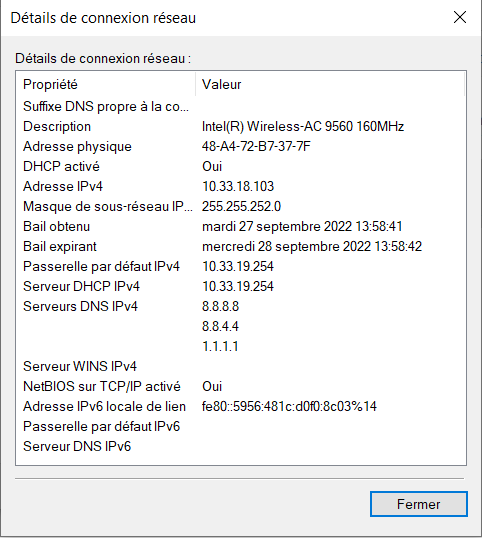
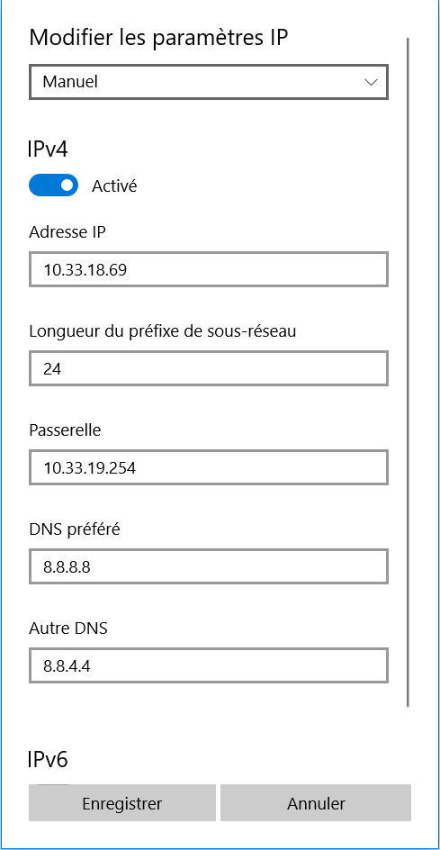
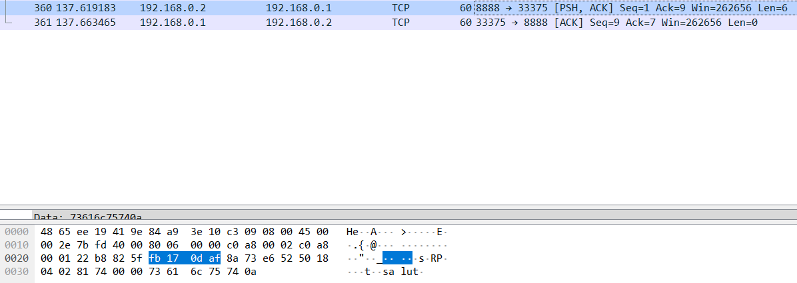
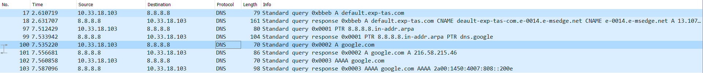

# TP1 - Mise en jambes

# Sommaire

- [Sommaire](#sommaire)
- [I. Exploration locale en solo](#i-exploration-locale-en-solo)
  - [1. Affichage d'informations sur la pile TCP/IP locale](#1-affichage-dinformations-sur-la-pile-tcpip-locale)
    - [En ligne de commande](#en-ligne-de-commande)
    - [Questions](#questions)
  - [2. Modifications des informations](#2-modifications-des-informations)
    - [A. Modification d'adresse IP (part 1)](#a-modification-dadresse-ip-part-1)
- [II. Exploration locale en duo](#ii-exploration-locale-en-duo)
  - [1. Modification d'adresse IP](#1-modification-dadresse-ip)
  - [2. Utilisation d'un des deux comme gateway](#2-utilisation-dun-des-deux-comme-gateway)
  - [3. Petit chat privé](#3-petit-chat-privé)
  - [4. Firewall](#4-firewall)
- [III. Manipulations d'autres outils/protocoles côté client](#iii-manipulations-dautres-outilsprotocoles-côté-client)
  - [1. DHCP](#1-dhcp)
  - [2. DNS](#2-dns)
- [IV. Wireshark](#iv-wireshark)

# I. Exploration locale en solo

## 1. Affichage d'informations sur la pile TCP/IP locale

### En ligne de commande

```
ipconfig /all

[...]

Carte réseau sans fil Wi-Fi :

   Adresse physique . . . . . . . . . . . : 48-A4-72-B7-37-7F
   Adresse IPv4. . . . . . . . . . . . . .: 10.33.18.103(préféré)
   Masque de sous-réseau. . . . . . . . . : 255.255.252.0

[...]


Carte Ethernet Ethernet :

   Adresse physique . . . . . . . . . . . : 84-A9-3E-10-C3-09

[...]

```

**🌞 Afficher la gateway**

```
ipconfig /all

Carte réseau sans fil Wi-Fi :


   Passerelle par défaut. . . . . . . . . : 10.33.19.254
```

**🌞 Trouvez comment afficher les informations sur une carte IP (change selon l'OS)**



### Questions

- 🌞 à quoi sert la gateway dans le réseau d'YNOV ?

La gateway sert à communiquer avec d'autres réseaux (internet)

## 2. Modifications des informations

### A. Modification d'adresse IP (part 1)

🌞 Utilisez l'interface graphique de votre OS pour **changer d'adresse IP** :



🌞 **Il est possible que l'on perde l'accès internet.** Si on perd l'accès à internet c'est parce qu'on a la même adresse ip qu'une autre machine du réseau.

# II. Exploration locale en duo

Owkay. Vous savez à ce stade :

- afficher les informations IP de votre machine
- modifier les informations IP de votre machine
- c'est un premier pas vers la maîtrise de votre outil de travail

On va maintenant répéter un peu ces opérations, mais en créant un réseau local de toutes pièces : entre deux PCs connectés avec un câble RJ45.

## 1. Modification d'adresse IP

🌞Si vos PCs ont un port RJ45 alors y'a une carte réseau Ethernet associée :

```
ipconfig /all

Carte Ethernet Ethernet :

   Adresse IPv4. . . . . . . . . . . . . .: 192.168.0.1(préféré)
   Masque de sous-réseau. . . . . . . . . : 255.255.255.252
   Passerelle par défaut. . . . . . . . . :


ping 192.168.0.2

Envoi d’une requête 'Ping'  192.168.0.2 avec 32 octets de données :
Réponse de 192.168.0.2 : octets=32 temps=2 ms TTL=64
Réponse de 192.168.0.2 : octets=32 temps=1 ms TTL=64

arp -a
Interface?: 192.168.0.1 --- 0x16
  Adresse Internet      Adresse physique      Type
  192.168.0.2           c8-5b-76-1b-3c-81     dynamique
  192.168.0.3           ff-ff-ff-ff-ff-ff     statique
  224.0.0.22            01-00-5e-00-00-16     statique
  224.0.0.251           01-00-5e-00-00-fb     statique
  224.0.0.252           01-00-5e-00-00-fc     statique
  239.255.255.250       01-00-5e-7f-ff-fa     statique
  255.255.255.255       ff-ff-ff-ff-ff-ff     statique
```

## 2. Utilisation d'un des deux comme gateway

---

- 🌞 pour tester la connectivité à internet on fait souvent des requêtes simples vers un serveur internet connu

```
Détermination de l’itinéraire vers dns.google [8.8.8.8]
avec un maximum de 30 sauts :

  1     1 ms     *        1 ms  LAPTOP-O33P794M [192.168.0.2]
  2     *        *        *     Délai d’attente de la demande dépassé.
  3     4 ms     4 ms     4 ms  10.33.19.254
  4     7 ms     5 ms     4 ms  137.149.196.77.rev.sfr.net [77.196.149.137]
  5    10 ms     9 ms    10 ms  108.97.30.212.rev.sfr.net [212.30.97.108]
  6    23 ms    21 ms    23 ms  222.172.136.77.rev.sfr.net [77.136.172.222]
  7    25 ms    24 ms    23 ms  221.172.136.77.rev.sfr.net [77.136.172.221]
  8    28 ms    25 ms    24 ms  186.144.6.194.rev.sfr.net [194.6.144.186]
  9    25 ms    25 ms    23 ms  186.144.6.194.rev.sfr.net [194.6.144.186]
 10    22 ms    21 ms    21 ms  72.14.194.30
 11    25 ms    23 ms    23 ms  172.253.69.49
 12    24 ms    23 ms    23 ms  108.170.238.107
 13    26 ms    22 ms    23 ms  dns.google [8.8.8.8]

Itinéraire déterminé.

```

## 3. Petit chat privé

Sur un Windows, ça donne un truc comme ça :

- 🌞 **sur le PC _client_**

```
C:\Program Files\netcat-win32-1.11\netcat-1.11>nc.exe   192.168.0.2 8888
bonjour
salut mec

```

- 🌞 **sur le PC _serveur_**

```

C:\Program Files\netcat-win32-1.11\netcat-1.11>nc64.exe -l -p 8888
bonjour
salut mec

```

---

- 🌞 pour aller un peu plus loin

```

C:\WINDOWS\system32>netstat -a -b -n | findstr 8888
TCP 192.168.0.2:8888 192.168.0.1:5180 ESTABLISHED

```

## 4. Firewall

Toujours par 2.

Le but est de configurer votre firewall plutôt que de le désactiver


# III. Manipulations d'autres outils/protocoles côté client

## 1. DHCP

🌞Exploration du DHCP, depuis votre PC

```

ipconfig /all

Carte réseau sans fil Wi-Fi :
DHCP activé. . . . . . . . . . . . . . : Oui
Bail obtenu. . . . . . . . . . . . . . : mercredi 28 septembre 2022 14:53:23
Bail expirant. . . . . . . . . . . . . : jeudi 29 septembre 2022 13:43:45
Passerelle par défaut. . . . . . . . . : 10.33.19.254
Serveur DHCP . . . . . . . . . . . . . : 10.33.19.254

```

## 2. DNS

```

ipconfig /all
[...]
Serveurs DNS. . . . . . . . . . . . . : 8.8.8.8
8.8.4.4
1.1.1.1

```

- 🌞 utiliser, en ligne de commande l'outil `nslookup`

```

nslookup google.com
[...]
Nom : google.com
Addresses: 2a00:1450:4007:808::200e
216.58.215.46

nslookup ynov.com
[...]
Nom : ynov.com
Addresses: 2606:4700:20::681a:ae9
2606:4700:20::ac43:4ae2
2606:4700:20::681a:be9
104.26.11.233
104.26.10.233
172.67.74.226

```

Google.com n'a qu'une seule adresse ip
Ynov.com a 3 adresses ip

```

nslookup 78.74.21.21
[...]
Nom : host-78-74-21-21.homerun.telia.com
Address: 78.74.21.21

nslookup 92.146.54.88
[...]
\*\*\* dns.google ne parvient pas a trouver 92.146.54.88 : Non-existent domain

```

L'adresse ip 78.74.21.21 est associé à un nom de domaine (host-78-74-21-21.homerun.telia.com)

L'adresse ip 92.146.54.88 n'a pas de nom de domaine

# IV. Wireshark


- 🌞 utilisez le pour observer les trames qui circulent entre vos deux carte Ethernet. Mettez en évidence :
  
  
  
